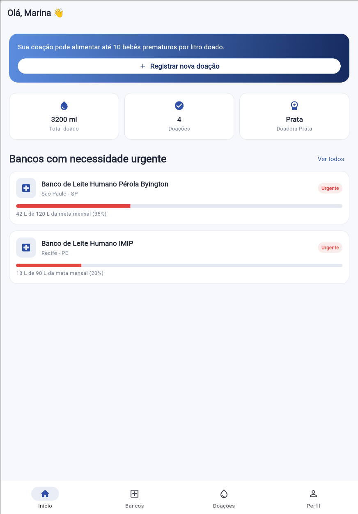
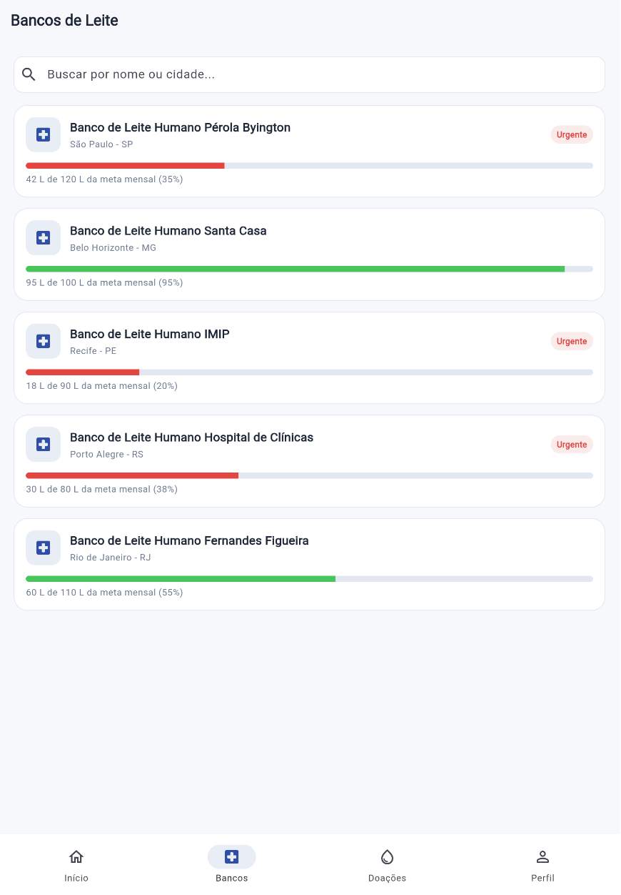
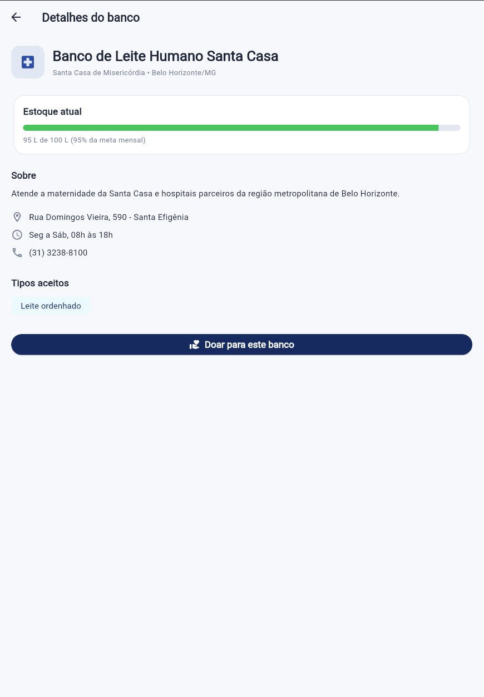
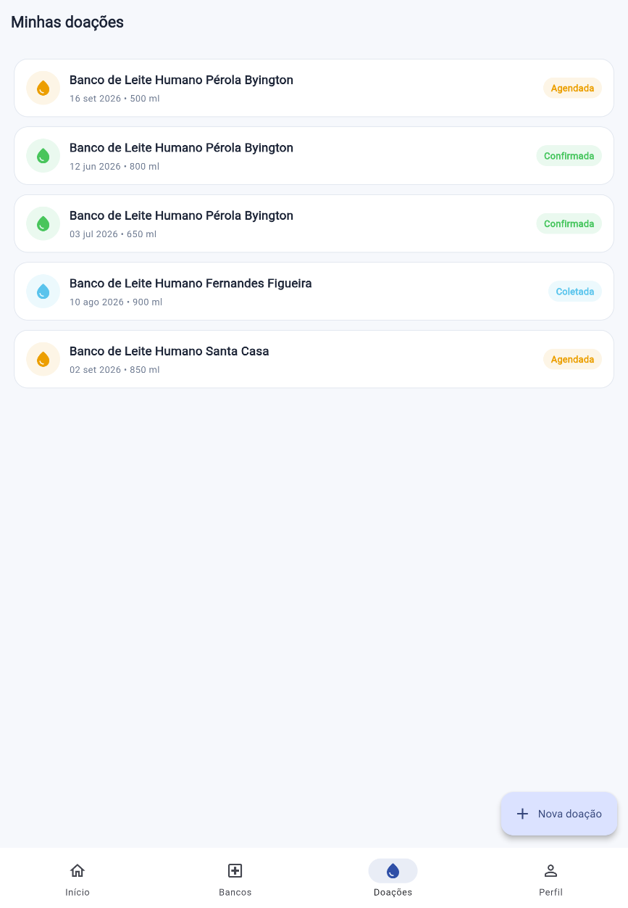
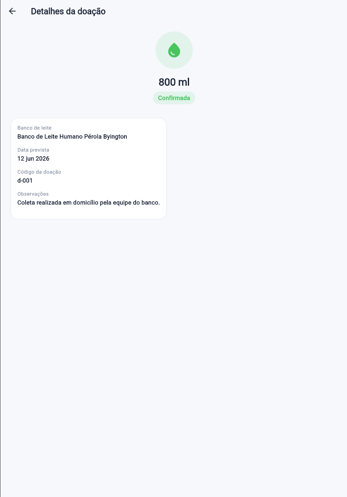
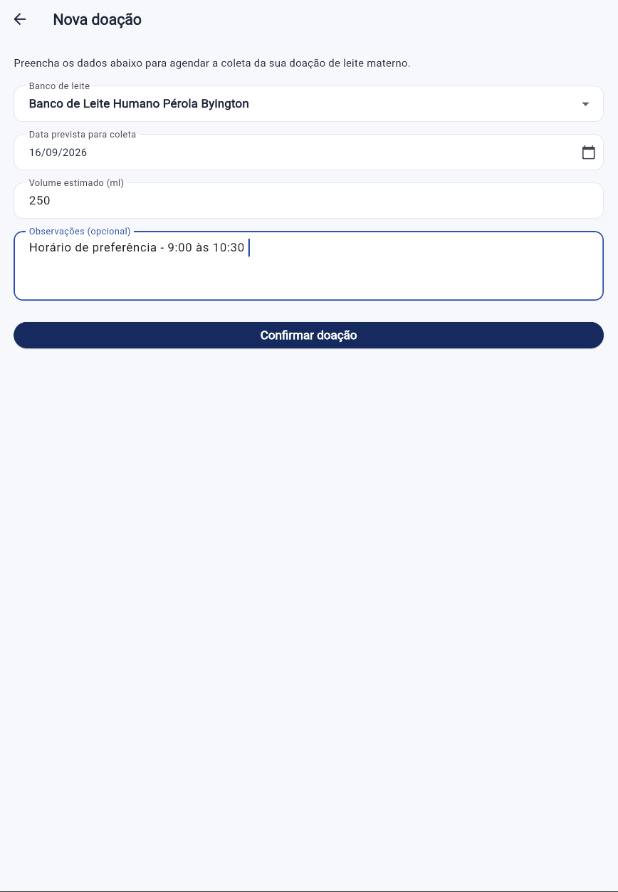
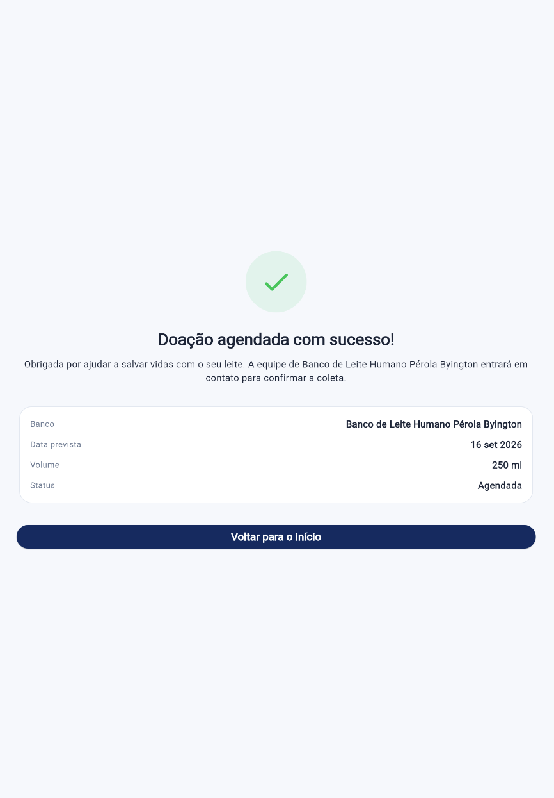
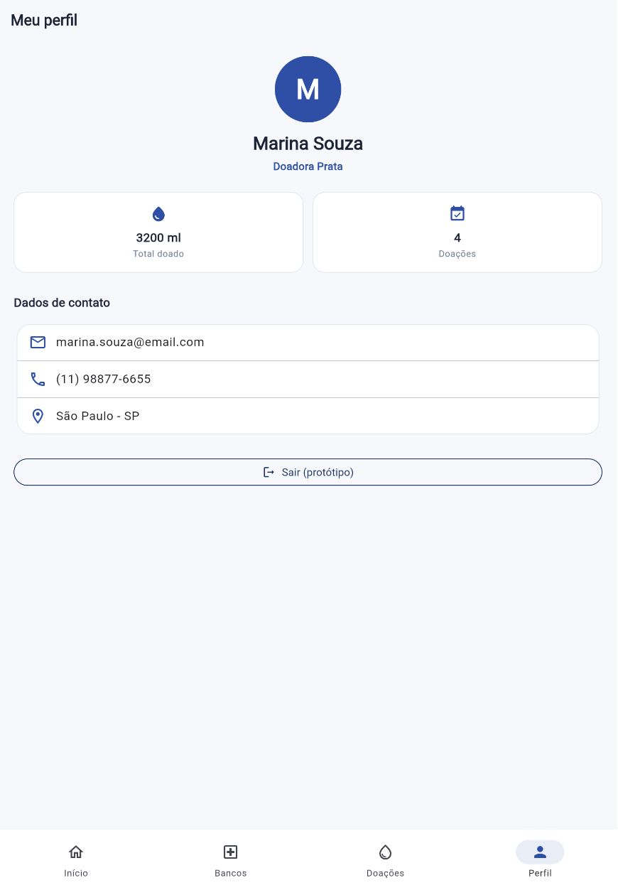

# Lactare 🤱💧

Plataforma mobile que conecta doadoras de leite materno a Bancos de Leite
Humano, facilitando o agendamento de doações e o acompanhamento do impacto
gerado por cada doadora.

## Equipe

- **Nome do projeto:** Lactare
- **Integrantes:**
  - Felipe Maringoli Teixeira — RM 556100
  - Gustavo Iudi Rosa Oda — RM 556754
  - Maria Eduarda de Araujo Fernandes — RM 554593
  - Rafael Catapani Scharlack — RM 554633
- **Link do repositório:** https://github.com/GustavoOda12/Sprint03_Flutter
- **Vídeo de demonstração:** https://youtu.be/fuOETdl_qIQ

## Objetivo do aplicativo

O **Lactare** é um protótipo navegável (Flutter, dados 100% mockados, sem
backend) que simula uma plataforma de doação de leite materno. A aplicação
permite que uma doadora:

- Visualize um painel inicial com seu impacto (total doado, nº de doações, nível de reconhecimento);
- Consulte a lista de Bancos de Leite Humano parceiros, com busca por nome/cidade;
- Veja o estoque atual de cada banco e identifique quais têm necessidade urgente;
- Registre uma nova doação, escolhendo banco, data prevista e volume estimado;
- Acompanhe o histórico e o status de suas doações (agendada, coletada, confirmada);
- Visualize seu perfil e dados de contato.

## Telas do aplicativo

| Tela | Descrição |
|---|---|
| **Splash** | Tela de apresentação do app e da proposta, com botão para entrar. |
| **Início (Home)** | Painel com estatísticas da doadora, atalho para nova doação e bancos com necessidade urgente. |
| **Bancos de Leite** | Lista de bancos parceiros com busca por nome/cidade e indicador de estoque. |
| **Detalhes do banco** | Informações completas do banco (endereço, horário, telefone, estoque, tipos aceitos) e botão para doar. |
| **Nova doação** | Formulário para agendar uma doação (banco, data, volume, observações). |
| **Confirmação** | Resumo da doação recém-agendada. |
| **Minhas doações** | Histórico de doações da usuária com status de cada uma. |
| **Detalhes da doação** | Detalhes completos de uma doação específica. |
| **Perfil** | Dados da doadora, estatísticas e nível de reconhecimento. |

### Prints das telas

1. MENU 

2. BANCOS DE LEITE

3. DOAÇÕES

4. CADASTRAR DOAÇÃO

5. PERFIL 

## Como executar o projeto

Pré-requisitos: [Flutter SDK](https://docs.flutter.dev/get-started/install)
instalado (canal stable) e um emulador Android configurado (ou dispositivo
físico com depuração USB habilitada).

\`\`\`bash
git clone https://github.com/GustavoOda12/Sprint03_Flutter.git
cd Sprint03_Flutter
flutter pub get
flutter run
\`\`\`

## Arquitetura do projeto

\`\`\`
lib/
├── main.dart
├── models/
├── data/
├── theme/
├── navigation/
├── widgets/
└── screens/
\`\`\`

## Tecnologias

- Flutter / Dart
- Material 3
- Dados mockados em memória (sem API, Firebase ou banco de dados)